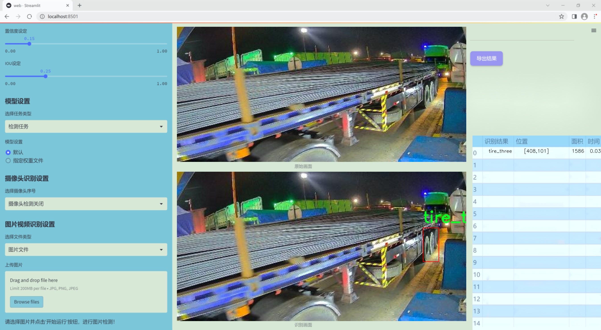
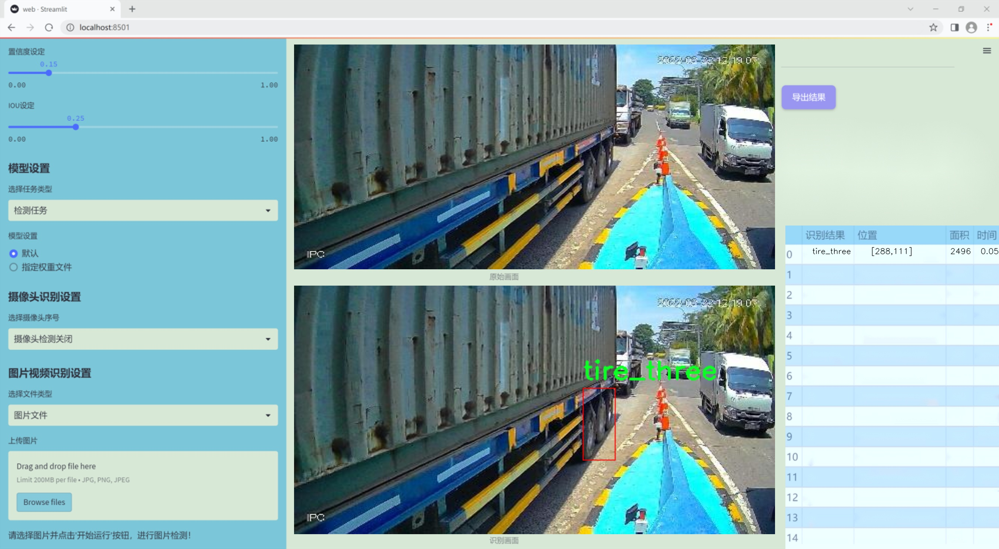
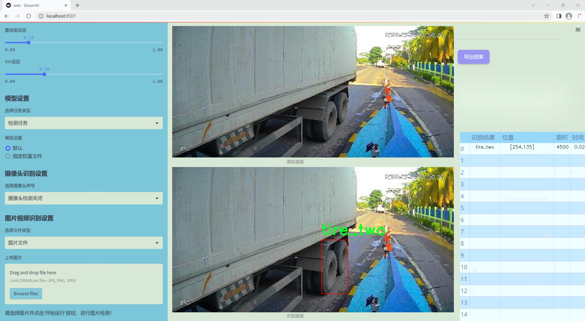
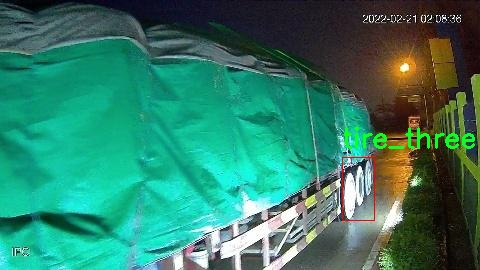
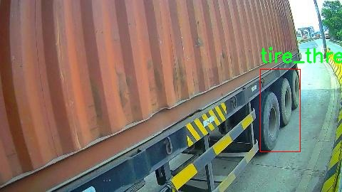
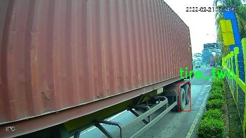
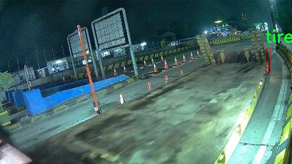
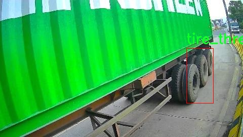

# 改进yolo11-HGNetV2等200+全套创新点大全：轮胎类型检测系统源码＆数据集全套

### 1.图片效果展示







##### 项目来源 **[人工智能促进会 2024.10.24](https://kdocs.cn/l/cszuIiCKVNis)**

注意：由于项目一直在更新迭代，上面“1.图片效果展示”和“2.视频效果展示”展示的系统图片或者视频可能为老版本，新版本在老版本的基础上升级如下：（实际效果以升级的新版本为准）

  （1）适配了YOLOV11的“目标检测”模型和“实例分割”模型，通过加载相应的权重（.pt）文件即可自适应加载模型。

  （2）支持“图片识别”、“视频识别”、“摄像头实时识别”三种识别模式。

  （3）支持“图片识别”、“视频识别”、“摄像头实时识别”三种识别结果保存导出，解决手动导出（容易卡顿出现爆内存）存在的问题，识别完自动保存结果并导出到tempDir中。

  （4）支持Web前端系统中的标题、背景图等自定义修改。

  另外本项目提供训练的数据集和训练教程,暂不提供权重文件（best.pt）,需要您按照教程进行训练后实现图片演示和Web前端界面演示的效果。

### 2.视频效果展示

[2.1 视频效果展示](https://www.bilibili.com/video/BV1H91NY3ES2/)

### 3.背景

研究背景与意义

随着汽车工业的快速发展，轮胎作为车辆的重要组成部分，其类型和状态直接影响到行车安全和车辆性能。因此，轮胎类型的准确检测在汽车维护、轮胎销售及智能交通系统中具有重要的应用价值。传统的轮胎检测方法多依赖人工识别，不仅效率低下，而且容易受到人为因素的影响，导致检测结果的不准确。近年来，深度学习技术的迅猛发展为图像识别领域带来了新的机遇，尤其是基于卷积神经网络（CNN）的目标检测算法，如YOLO（You Only Look Once），因其高效性和实时性而受到广泛关注。

本研究旨在基于改进的YOLOv11模型，构建一个高效的轮胎类型检测系统。我们使用的数据集包含2700张图像，涵盖了三种轮胎类型：tire_one、tire_two和tire_three。这一数据集的构建不仅为模型的训练提供了丰富的样本，还为轮胎类型的分类提供了良好的基础。通过对YOLOv11模型的改进，我们期望能够提升模型在轮胎类型检测中的准确性和鲁棒性，从而实现更高效的自动化检测。

在智能交通和汽车维护的背景下，轮胎类型检测系统的应用前景广阔。该系统不仅可以提高轮胎管理的智能化水平，还能够为车主提供实时的轮胎状态监测，进而提升行车安全。此外，基于深度学习的检测系统也为轮胎制造商和销售商提供了更为精准的市场分析工具，帮助其优化产品和服务。因此，本研究的开展不仅具有重要的理论意义，还有助于推动汽车行业的智能化发展，为实现安全、便捷的交通环境贡献力量。

### 4.数据集信息展示

##### 4.1 本项目数据集详细数据（类别数＆类别名）

nc: 3
names: ['tire_one', 'tire_three', 'tire_two']


该项目为【目标检测】数据集，请在【训练教程和Web端加载模型教程（第三步）】这一步的时候按照【目标检测】部分的教程来训练

##### 4.2 本项目数据集信息介绍

本项目数据集信息介绍

本项目所使用的数据集名为“Cam3”，旨在为改进YOLOv11的轮胎类型检测系统提供高质量的训练数据。该数据集包含三种不同类型的轮胎，具体类别包括“tire_one”、“tire_two”和“tire_three”。这些类别的选择是基于市场上常见的轮胎类型，确保模型能够有效识别和分类多样化的轮胎设计和结构特征。

“Cam3”数据集的构建过程注重数据的多样性和代表性，确保涵盖不同品牌、型号及使用环境的轮胎样本。这种多样性不仅有助于提高模型的泛化能力，还能增强其在实际应用中的准确性和可靠性。数据集中每种轮胎类型的样本数量经过精心设计，以保证模型在训练过程中能够获得足够的学习信号，从而提高对每种轮胎类型的识别能力。

在数据采集过程中，采用了高分辨率的图像捕捉技术，确保每个样本的细节清晰可见。这些图像在不同的光照条件和背景下拍摄，以模拟实际应用中可能遇到的各种场景。此外，数据集还经过了严格的标注流程，确保每个轮胎样本的类别标注准确无误，为模型的训练提供了坚实的基础。

通过使用“Cam3”数据集，改进后的YOLOv11模型将能够更好地识别和分类不同类型的轮胎，从而提升轮胎检测系统的整体性能。这不仅有助于汽车行业的智能化发展，也为相关领域的研究提供了宝贵的数据支持。随着技术的不断进步，期待该数据集能够为未来的轮胎检测研究和应用提供更多的可能性。











### 5.全套项目环境部署视频教程（零基础手把手教学）

[5.1 所需软件PyCharm和Anaconda安装教程（第一步）](https://www.bilibili.com/video/BV1BoC1YCEKi/?spm_id_from=333.999.0.0&vd_source=bc9aec86d164b67a7004b996143742dc)


[5.2 安装Python虚拟环境创建和依赖库安装视频教程（第二步）](https://www.bilibili.com/video/BV1ZoC1YCEBw?spm_id_from=333.788.videopod.sections&vd_source=bc9aec86d164b67a7004b996143742dc)

### 6.改进YOLOv11训练教程和Web_UI前端加载模型教程（零基础手把手教学）

[6.1 改进YOLOv11训练教程和Web_UI前端加载模型教程（第三步）](https://www.bilibili.com/video/BV1BoC1YCEhR?spm_id_from=333.788.videopod.sections&vd_source=bc9aec86d164b67a7004b996143742dc)


按照上面的训练视频教程链接加载项目提供的数据集，运行train.py即可开始训练



     Epoch   gpu_mem       box       obj       cls    labels  img_size
     1/200     20.8G   0.01576   0.01955  0.007536        22      1280: 100%|██████████| 849/849 [14:42<00:00,  1.04s/it]
               Class     Images     Labels          P          R     mAP@.5 mAP@.5:.95: 100%|██████████| 213/213 [01:14<00:00,  2.87it/s]
                 all       3395      17314      0.994      0.957      0.0957      0.0843

     Epoch   gpu_mem       box       obj       cls    labels  img_size
     2/200     20.8G   0.01578   0.01923  0.007006        22      1280: 100%|██████████| 849/849 [14:44<00:00,  1.04s/it]
               Class     Images     Labels          P          R     mAP@.5 mAP@.5:.95: 100%|██████████| 213/213 [01:12<00:00,  2.95it/s]
                 all       3395      17314      0.996      0.956      0.0957      0.0845

     Epoch   gpu_mem       box       obj       cls    labels  img_size
     3/200     20.8G   0.01561    0.0191  0.006895        27      1280: 100%|██████████| 849/849 [10:56<00:00,  1.29it/s]
               Class     Images     Labels          P          R     mAP@.5 mAP@.5:.95: 100%|███████   | 187/213 [00:52<00:00,  4.04it/s]
                 all       3395      17314      0.996      0.957      0.0957      0.0845


###### [项目数据集下载链接](https://kdocs.cn/l/cszuIiCKVNis)

### 7.原始YOLOv11算法讲解


ultralytics发布了最新的作品YOLOv11，这一次YOLOv11的变化相对于ultralytics公司的上一代作品YOLOv8变化不是很大的（YOLOv9、YOLOv10均不是ultralytics公司作品），其中改变的位置涉及到C2f变为C3K2，在SPPF后面加了一层类似于注意力机制的C2PSA，还有一个变化大家从yaml文件是看不出来的就是它的检测头内部替换了两个DWConv，以及模型的深度和宽度参数进行了大幅度调整，但是在损失函数方面就没有变化还是采用的CIoU作为边界框回归损失，下面带大家深入理解一下ultralytics最新作品YOLOv11的创新点。

**下图为最近的YOLO系列发布时间线！**


* * *

###### YOLOv11和YOLOv8对比

在YOLOYOLOv5，YOLOv8，和YOLOv11是ultralytics公司作品（ultralytics出品必属精品），下面用一张图片从yaml文件来带大家对比一下YOLOv8和YOLOv11的区别，配置文件变得内容比较少大家可以看一卡，左侧为YOLOv8右侧为YOLOv11，不同的点我用黑线标注了出来。


* * *

###### YOLOv11的网络结构解析

下面的图片为YOLOv11的网络结构图。


**其中主要创新点可以总结如下- > **

* * *

1\.
提出C3k2机制，其中C3k2有参数为c3k，其中在网络的浅层c3k设置为False（下图中可以看到c3k2第二个参数被设置为False，就是对应的c3k参数）。


此时所谓的C3k2就相当于YOLOv8中的C2f，其网络结构为一致的，其中的C3k机制的网络结构图如下图所示
**（为什么叫C3k2，我个人理解是因为C3k的调用时C3k其中的参数N固定设置为2的原因，个人理解不一定对** ）。


* * *

2\.
第二个创新点是提出C2PSA机制，这是一个C2（C2f的前身）机制内部嵌入了一个多头注意力机制，在这个过程中我还发现作者尝试了C2fPSA机制但是估计效果不如C2PSA，有的时候机制有没有效果理论上真的很难解释通，下图为C2PSA机制的原理图，仔细观察把Attention哪里去掉则C2PSA机制就变为了C2所以我上面说C2PSA就是C2里面嵌入了一个PSA机制。


* * *

3\.
第三个创新点可以说是原先的解耦头中的分类检测头增加了两个DWConv，具体的对比大家可以看下面两个图下面的是YOLOv11的解耦头，上面的是YOLOv8的解耦头.


我们上面看到了在分类检测头中YOLOv11插入了两个DWConv这样的做法可以大幅度减少参数量和计算量（原先两个普通的Conv大家要注意到卷积和是由3变为了1的，这是形成了两个深度可分离Conv），大家可能不太理解为什么加入了两个DWConv还能够减少计算量，以及什么是深度可分离Conv，下面我来解释一下。

> **`DWConv` 代表 Depthwise
> Convolution（深度卷积）**，是一种在卷积神经网络中常用的高效卷积操作。它主要用于减少计算复杂度和参数量，尤其在移动端或轻量化网络（如
> MobileNet）中十分常见。
>
> **1\. 标准卷积的计算过程**
>
> 在标准卷积操作中，对于一个输入张量（通常是一个多通道的特征图），卷积核的尺寸是 `(h, w, C_in)`，其中 `h` 和 `w`
> 是卷积核的空间尺寸，`C_in`
> 是输入通道的数量。而卷积核与输入张量做的是完整的卷积运算，每个输出通道都与所有输入通道相连并参与卷积操作，导致计算量比较大。
>
> 标准卷积的计算过程是这样的：
>
>   * 每个输出通道是所有输入通道的组合（加权求和），卷积核在每个位置都会计算与所有输入通道的点积。
>   * 假设有 `C_in` 个输入通道和 `C_out` 个输出通道，那么卷积核的总参数量是 `C_in * C_out * h * w`。
>

>
> 2\. **Depthwise Convolution（DWConv）**
>
> 与标准卷积不同， **深度卷积** 将输入的每个通道单独处理，即 **每个通道都有自己的卷积核进行卷积**
> ，不与其他通道进行交互。它可以被看作是标准卷积的一部分，专注于空间维度上的卷积运算。
>
> **深度卷积的计算过程：**
>
>   * 假设输入张量有 `C_in` 个通道，每个通道会使用一个 `h × w`
> 的卷积核进行卷积操作。这个过程称为“深度卷积”，因为每个通道独立进行卷积运算。
>   * 输出的通道数与输入通道数一致，每个输出通道只和对应的输入通道进行卷积，没有跨通道的组合。
>   * 参数量和计算量相比标准卷积大大减少，卷积核的参数量是 `C_in * h * w`。
>

>
> **深度卷积的优点：**
>
>   1. **计算效率高** ：相对于标准卷积，深度卷积显著减少了计算量。它只处理空间维度上的卷积，不再处理通道间的卷积。
>   2.  **参数量减少** ：由于每个卷积核只对单个通道进行卷积，参数量大幅减少。例如，标准卷积的参数量为 `C_in * C_out * h *
> w`，而深度卷积的参数量为 `C_in * h * w`。
>   3.  **结合点卷积可提升效果** ：为了弥补深度卷积缺乏跨通道信息整合的问题，通常深度卷积后会配合 `1x1` 的点卷积（Pointwise
> Convolution）使用，通过 `1x1` 的卷积核整合跨通道的信息。这种组合被称为 **深度可分离卷积** （Depthwise
> Separable Convolution） | **这也是我们本文YOLOv11中的做法** 。
>

>
> 3\. **深度卷积与标准卷积的区别**
>
> 操作类型| 卷积核大小| 输入通道数| 输出通道数| 参数量  
> ---|---|---|---|---  
> 标准卷积| `h × w`| `C_in`| `C_out`| `C_in * C_out * h * w`  
> 深度卷积（DWConv）| `h × w`| `C_in`| `C_in`| `C_in * h * w`  
>  
> 可以看出，深度卷积在相同的卷积核大小下，参数量减少了约 `C_out` 倍
> （细心的人可以发现用最新版本的ultralytics仓库运行YOLOv8参数量相比于之前的YOLOv8以及大幅度减少了这就是因为检测头改了的原因但是名字还是Detect，所以如果你想继续用YOLOv8发表论文做实验那么不要更新最近的ultralytics仓库）。
>
> **4\. 深度可分离卷积 (Depthwise Separable Convolution)**
>
> 深度卷积常与 `1x1` 的点卷积配合使用，这称为深度可分离卷积。其过程如下：
>
>   1. 先对输入张量进行深度卷积，对每个通道独立进行空间卷积。
>   2. 然后通过 `1x1` 点卷积，对通道维度进行混合，整合不同通道的信息。
>

>
> 这样既可以保证计算量的减少，又可以保持跨通道的信息流动。
>
> 5\. **总结**
>
> `DWConv` 是一种高效的卷积方式，通过单独处理每个通道来减少计算量，结合 `1x1`
> 的点卷积，形成深度可分离卷积，可以在保持网络性能的同时极大地减少模型的计算复杂度和参数量。

**看到这里大家应该明白了为什么加入了两个DWConv还能减少参数量以及YOLOv11的检测头创新点在哪里。**

* * *

##### YOLOv11和YOLOv8还有一个不同的点就是其各个版本的模型（N - S - M- L - X）网络深度和宽度变了


可以看到在深度（depth）和宽度
（width）两个地方YOLOv8和YOLOv11是基本上完全不同了，这里我理解这么做的含义就是模型网络变小了，所以需要加深一些模型的放缩倍数来弥补模型之前丧失的能力从而来达到一个平衡。

> **本章总结：**
> YOLOv11的改进点其实并不多更多的都是一些小的结构上的创新，相对于之前的YOLOv5到YOLOv8的创新，其实YOLOv11的创新点不算多，但是其是ultralytics公司的出品，同时ultralytics仓库的使用量是非常多的（不像YOLOv9和YOLOv10）所以在未来的很长一段时间内其实YOLO系列估计不会再更新了，YOLOv11作为最新的SOTA肯定是十分适合大家来发表论文和创新的。
>

### 8.200+种全套改进YOLOV11创新点原理讲解

#### 8.1 200+种全套改进YOLOV11创新点原理讲解大全

由于篇幅限制，每个创新点的具体原理讲解就不全部展开，具体见下列网址中的改进模块对应项目的技术原理博客网址【Blog】（创新点均为模块化搭建，原理适配YOLOv5~YOLOv11等各种版本）

[改进模块技术原理博客【Blog】网址链接](https://gitee.com/qunmasj/good)


#### 8.2 精选部分改进YOLOV11创新点原理讲解

###### 这里节选部分改进创新点展开原理讲解(完整的改进原理见上图和[改进模块技术原理博客链接](https://gitee.com/qunmasj/good)【如果此小节的图加载失败可以通过CSDN或者Github搜索该博客的标题访问原始博客，原始博客图片显示正常】


借鉴了其他算法的这些设计思想

借鉴了VGG的思想，使用了较多的3×3卷积，在每一次池化操作后，将通道数翻倍；

借鉴了network in network的思想，使用全局平均池化（global average pooling）做预测，并把1×1的卷积核置于3×3的卷积核之间，用来压缩特征；（我没找到这一步体现在哪里）

使用了批归一化层稳定模型训练，加速收敛，并且起到正则化作用。

    以上三点为Darknet19借鉴其他模型的点。Darknet53当然是在继承了Darknet19的这些优点的基础上再新增了下面这些优点的。因此列在了这里

借鉴了ResNet的思想，在网络中大量使用了残差连接，因此网络结构可以设计的很深，并且缓解了训练中梯度消失的问题，使得模型更容易收敛。

使用步长为2的卷积层代替池化层实现降采样。（这一点在经典的Darknet-53上是很明显的，output的长和宽从256降到128，再降低到64，一路降低到8，应该是通过步长为2的卷积层实现的；在YOLOv11的卷积层中也有体现，比如图中我标出的这些位置）

#### 特征融合

模型架构图如下

  Darknet-53的特点可以这样概括：（Conv卷积模块+Residual Block残差块）串行叠加4次

  Conv卷积层+Residual Block残差网络就被称为一个stage


上面红色指出的那个，原始的Darknet-53里面有一层 卷积，在YOLOv11里面，把一层卷积移除了

为什么移除呢？

        原始Darknet-53模型中间加的这个卷积层做了什么？滤波器（卷积核）的个数从 上一个卷积层的512个，先增加到1024个卷积核，然后下一层卷积的卷积核的个数又降低到512个

        移除掉这一层以后，少了1024个卷积核，就可以少做1024次卷积运算，同时也少了1024个3×3的卷积核的参数，也就是少了9×1024个参数需要拟合。这样可以大大减少了模型的参数，（相当于做了轻量化吧）

        移除掉这个卷积层，可能是因为作者发现移除掉这个卷积层以后，模型的score有所提升，所以才移除掉的。为什么移除掉以后，分数有所提高呢？可能是因为多了这些参数就容易，参数过多导致模型在训练集删过拟合，但是在测试集上表现很差，最终模型的分数比较低。你移除掉这个卷积层以后，参数减少了，过拟合现象不那么严重了，泛化能力增强了。当然这个是，拿着你做实验的结论，反过来再找补，再去强行解释这种现象的合理性。

过拟合


通过MMdetection官方绘制册这个图我们可以看到，进来的这张图片经过一个“Feature Pyramid Network(简称FPN)”，然后最后的P3、P4、P5传递给下一层的Neck和Head去做识别任务。 PAN（Path Aggregation Network）


“FPN是自顶向下，将高层的强语义特征传递下来。PAN就是在FPN的后面添加一个自底向上的金字塔，对FPN补充，将低层的强定位特征传递上去，

FPN是自顶（小尺寸，卷积次数多得到的结果，语义信息丰富）向下（大尺寸，卷积次数少得到的结果），将高层的强语义特征传递下来，对整个金字塔进行增强，不过只增强了语义信息，对定位信息没有传递。PAN就是针对这一点，在FPN的后面添加一个自底（卷积次数少，大尺寸）向上（卷积次数多，小尺寸，语义信息丰富）的金字塔，对FPN补充，将低层的强定位特征传递上去，又被称之为“双塔战术”。

FPN层自顶向下传达强语义特征，而特征金字塔则自底向上传达强定位特征，两两联手，从不同的主干层对不同的检测层进行参数聚合,这样的操作确实很皮。
#### 自底向上增强

而 PAN（Path Aggregation Network）是对 FPN 的一种改进，它的设计理念是在 FPN 后面添加一个自底向上的金字塔。PAN 引入了路径聚合的方式，通过将浅层特征图（低分辨率但语义信息较弱）和深层特征图（高分辨率但语义信息丰富）进行聚合，并沿着特定的路径传递特征信息，将低层的强定位特征传递上去。这样的操作能够进一步增强多尺度特征的表达能力，使得 PAN 在目标检测任务中表现更加优秀。


### 可重参化EfficientRepBiPAN优化Neck
#### Repvgg-style
Repvgg-style的卷积层包含
卷积+ReLU结构，该结构能够有效地利用硬件资源。

在训练时，Repvgg-style的卷积层包含
卷积、
卷积、identity。（下图左图）


在推理时，通过重参数化（re-parameterization），上述的多分支结构可以转换为单分支的
卷积。（下图右图）


基于上述思想，作者设计了对GPU硬件友好的EfficientRep Backbone和Rep-PAN Neck，将它们用于YOLOv6中。

EfficientRep Backbone的结构图：


Rep-PAN Neck结构图：


#### Multi-path
只使用repvgg-style不能达到很好的精度-速度平衡，对于大模型，作者探索了多路径的网络结构。

参考该博客提出了Bep unit，其结构如下图所示：


CSP（Cross Stage Partial）-style计算量小，且有丰富的梯度融合信息，广泛应用于YOLO系列中，比如YOLOv11、PPYOLOE。

作者将Bep unit与CSP-style结合，设计了一种新的网络结构BepC3，如下图所示：


基于BepC3模块，作者设计了新的CSPBep Backbone和CSPRepPAN Neck，以达到很好的精度-速度平衡。

其他YOLO系列在使用CSP-stype结构时，partial ratio设置为1/2。为了达到更好的性能，在YOLOv6m中partial ratio的值为2/3，在YOLOv6l中partial ratio的值为1/2。

对于YOLOv6m，单纯使用Rep-style结构和使用BepC3结构的对比如下图所示：

#### BIFPN
BiFPN 全称 Bidirectional Feature Pyramid Network 加权双向（自顶向下 + 自低向上）特征金字塔网络。

相比较于PANet，BiFPN在设计上的改变：

总结下图：
图d 蓝色部分为自顶向下的通路，传递的是高层特征的语义信息；红色部分是自底向上的通路，传递的是低层特征的位置信息；紫色部分是上述第二点提到的同一层在输入节点和输入节点间新加的一条边。


我们删除那些只有一条输入边的节点。这么做的思路很简单：如果一个节点只有一条输入边而没有特征融合，那么它对旨在融合不同特征的特征网络的贡献就会很小。删除它对我们的网络影响不大，同时简化了双向网络；如上图d 的 P7右边第一个节点

如果原始输入节点和输出节点处于同一层，我们会在原始输入节点和输出节点之间添加一条额外的边。思路：以在不增加太多成本的情况下融合更多的特性；

与只有一个自顶向下和一个自底向上路径的PANet不同，我们处理每个双向路径(自顶向下和自底而上)路径作为一个特征网络层，并重复同一层多次，以实现更高层次的特征融合。如下图EfficientNet 的网络结构所示，我们对BiFPN是重复使用多次的。而这个使用次数也不是我们认为设定的，而是作为参数一起加入网络的设计当中，使用NAS技术算出来的。


Weighted Feature Fusion 带权特征融合：学习不同输入特征的重要性，对不同输入特征有区分的融合。
设计思路：传统的特征融合往往只是简单的 feature map 叠加/相加 (sum them up)，比如使用concat或者shortcut连接，而不对同时加进来的 feature map 进行区分。然而，不同的输入 feature map 具有不同的分辨率，它们对融合输入 feature map 的贡献也是不同的，因此简单的对他们进行相加或叠加处理并不是最佳的操作。所以这里我们提出了一种简单而高效的加权特融合的机制。
常见的带权特征融合有三种方法，分别是：


​
  这种方法比较简单，直接加一个可学习的权重。但是由于这个权重不受限制，所有可能引起训练的不稳定，所有并不推荐。
Softmax-based fusion: O = ∑ i e w i ∗ I i ϵ + ∑ j e w j O = \sum_{i} \frac{e^{w_i} * I_i}{ \epsilon+\sum_{j}e^{w_j}}O=∑ 

 

​
  使用这种方法可以将范围放缩到 [ 0 , 1 ] [0, 1][0,1] 之间，训练稳定，但是训练很慢，所有也不推荐。
Fast normalized fusion: O = ∑ i w i ∗ I i ϵ + ∑ j w j O = \sum_{i} \frac{w_i * I_i}{ \epsilon+\sum_{j}w_j}O=∑ 


### 9.系统功能展示

图9.1.系统支持检测结果表格显示

  图9.2.系统支持置信度和IOU阈值手动调节

  图9.3.系统支持自定义加载权重文件best.pt(需要你通过步骤5中训练获得)

  图9.4.系统支持摄像头实时识别

  图9.5.系统支持图片识别

  图9.6.系统支持视频识别

  图9.7.系统支持识别结果文件自动保存

  图9.8.系统支持Excel导出检测结果数据


### 10. YOLOv11核心改进源码讲解

#### 10.1 conv.py

以下是经过精简和注释的核心代码部分，主要包括卷积模块及其相关功能的实现：

```python
import math
import torch
import torch.nn as nn

def autopad(k, p=None, d=1):
    """自动计算填充以保持输出形状不变。"""
    if d > 1:
        k = d * (k - 1) + 1 if isinstance(k, int) else [d * (x - 1) + 1 for x in k]  # 实际卷积核大小
    if p is None:
        p = k // 2 if isinstance(k, int) else [x // 2 for x in k]  # 自动填充
    return p

class Conv(nn.Module):
    """标准卷积层，包含卷积、批归一化和激活函数。"""

    default_act = nn.SiLU()  # 默认激活函数

    def __init__(self, c1, c2, k=1, s=1, p=None, g=1, d=1, act=True):
        """初始化卷积层。"""
        super().__init__()
        self.conv = nn.Conv2d(c1, c2, k, s, autopad(k, p, d), groups=g, dilation=d, bias=False)
        self.bn = nn.BatchNorm2d(c2)  # 批归一化
        self.act = self.default_act if act is True else act if isinstance(act, nn.Module) else nn.Identity()

    def forward(self, x):
        """前向传播：卷积 -> 批归一化 -> 激活函数。"""
        return self.act(self.bn(self.conv(x)))

class DWConv(Conv):
    """深度卷积层。"""

    def __init__(self, c1, c2, k=1, s=1, d=1, act=True):
        """初始化深度卷积层。"""
        super().__init__(c1, c2, k, s, g=math.gcd(c1, c2), d=d, act=act)

class DSConv(nn.Module):
    """深度可分离卷积。"""

    def __init__(self, c1, c2, k=1, s=1, d=1, act=True):
        """初始化深度可分离卷积。"""
        super().__init__()
        self.dwconv = DWConv(c1, c1, 3)  # 深度卷积
        self.pwconv = Conv(c1, c2, 1)    # 点卷积

    def forward(self, x):
        """前向传播：深度卷积 -> 点卷积。"""
        return self.pwconv(self.dwconv(x))

class ConvTranspose(nn.Module):
    """转置卷积层。"""

    default_act = nn.SiLU()  # 默认激活函数

    def __init__(self, c1, c2, k=2, s=2, p=0, bn=True, act=True):
        """初始化转置卷积层。"""
        super().__init__()
        self.conv_transpose = nn.ConvTranspose2d(c1, c2, k, s, p, bias=not bn)
        self.bn = nn.BatchNorm2d(c2) if bn else nn.Identity()
        self.act = self.default_act if act is True else act if isinstance(act, nn.Module) else nn.Identity()

    def forward(self, x):
        """前向传播：转置卷积 -> 批归一化 -> 激活函数。"""
        return self.act(self.bn(self.conv_transpose(x)))

class ChannelAttention(nn.Module):
    """通道注意力模块。"""

    def __init__(self, channels: int):
        """初始化通道注意力模块。"""
        super().__init__()
        self.pool = nn.AdaptiveAvgPool2d(1)  # 自适应平均池化
        self.fc = nn.Conv2d(channels, channels, 1, 1, 0, bias=True)  # 1x1卷积
        self.act = nn.Sigmoid()  # Sigmoid激活

    def forward(self, x: torch.Tensor) -> torch.Tensor:
        """前向传播：计算通道注意力并加权输入。"""
        return x * self.act(self.fc(self.pool(x)))

class SpatialAttention(nn.Module):
    """空间注意力模块。"""

    def __init__(self, kernel_size=7):
        """初始化空间注意力模块。"""
        super().__init__()
        assert kernel_size in {3, 7}, "kernel size must be 3 or 7"
        padding = 3 if kernel_size == 7 else 1
        self.cv1 = nn.Conv2d(2, 1, kernel_size, padding=padding, bias=False)  # 卷积层
        self.act = nn.Sigmoid()  # Sigmoid激活

    def forward(self, x):
        """前向传播：计算空间注意力并加权输入。"""
        return x * self.act(self.cv1(torch.cat([torch.mean(x, 1, keepdim=True), torch.max(x, 1, keepdim=True)[0]], 1)))

class CBAM(nn.Module):
    """卷积块注意力模块。"""

    def __init__(self, c1, kernel_size=7):
        """初始化CBAM模块。"""
        super().__init__()
        self.channel_attention = ChannelAttention(c1)  # 通道注意力
        self.spatial_attention = SpatialAttention(kernel_size)  # 空间注意力

    def forward(self, x):
        """前向传播：通道注意力 -> 空间注意力。"""
        return self.spatial_attention(self.channel_attention(x))
```

### 代码分析
1. **自动填充函数 `autopad`**：根据卷积核大小和扩张率自动计算填充，以保持输出形状与输入形状相同。
  
2. **卷积类 `Conv`**：实现了标准卷积操作，包含卷积、批归一化和激活函数的组合。

3. **深度卷积类 `DWConv`**：继承自 `Conv`，实现深度卷积操作，适用于分组卷积。

4. **深度可分离卷积类 `DSConv`**：结合深度卷积和点卷积，以减少参数量和计算量。

5. **转置卷积类 `ConvTranspose`**：实现转置卷积操作，通常用于上采样。

6. **通道注意力模块 `ChannelAttention`**：通过自适应平均池化和1x1卷积计算通道注意力。

7. **空间注意力模块 `SpatialAttention`**：通过对输入特征图进行平均和最大池化后拼接，计算空间注意力。

8. **CBAM模块 `CBAM`**：结合通道注意力和空间注意力的模块，提升特征图的表达能力。

这些模块在深度学习模型中广泛应用，尤其是在目标检测和图像分割等任务中，能够有效提升模型的性能。

这个文件 `conv.py` 定义了一系列用于卷积操作的模块，主要用于构建深度学习模型，特别是与 YOLO（You Only Look Once）相关的模型。文件中包含多个类，每个类实现了不同类型的卷积操作和相关功能。

首先，文件引入了必要的库，包括 `math`、`numpy` 和 `torch`，并定义了一个 `autopad` 函数，该函数用于根据卷积核的大小、填充和扩张参数自动计算填充的大小，以确保输出的形状与输入的形状相同。

接下来，定义了多个卷积类：

1. **Conv** 类实现了标准的卷积操作，包含卷积层、批归一化层和激活函数。其构造函数接受多个参数，包括输入通道数、输出通道数、卷积核大小、步幅、填充、分组和扩张等。`forward` 方法执行卷积、批归一化和激活操作。

2. **Conv2** 类是一个简化的卷积模块，使用了两个卷积层的组合，增强了特征提取能力。它提供了 `fuse_convs` 方法，用于将两个卷积层融合为一个。

3. **LightConv** 类实现了轻量级卷积，通过组合标准卷积和深度卷积来提高效率。

4. **DWConv** 类实现了深度卷积，即对每个输入通道独立进行卷积，通常用于减少模型参数。

5. **DSConv** 类实现了深度可分离卷积，结合了深度卷积和逐点卷积的特点，以减少计算量。

6. **DWConvTranspose2d** 类实现了深度转置卷积，主要用于上采样操作。

7. **ConvTranspose** 类实现了转置卷积，支持批归一化和激活函数。

8. **Focus** 类用于将输入的空间信息聚合到通道维度，增强特征表达能力。

9. **GhostConv** 类实现了 Ghost 卷积，通过主卷积和廉价操作组合来高效提取特征。

10. **RepConv** 类实现了重复卷积模块，支持训练和推理状态的切换，并能融合卷积层以减少计算。

11. **ChannelAttention** 和 **SpatialAttention** 类实现了通道注意力和空间注意力机制，分别用于增强特征的通道信息和空间信息。

12. **CBAM** 类结合了通道注意力和空间注意力，形成一个完整的卷积块注意力模块。

13. **Concat** 类用于在指定维度上连接多个张量，常用于特征融合。

整体而言，这个文件中的模块为构建复杂的神经网络提供了基础组件，尤其适合于目标检测和图像处理任务。每个模块都经过精心设计，以提高模型的性能和效率。

#### 10.2 attention.py

以下是保留的核心代码部分，并附上详细的中文注释：

```python
import torch
from torch import nn

class EMA(nn.Module):
    def __init__(self, channels, factor=8):
        super(EMA, self).__init__()
        self.groups = factor  # 分组数
        assert channels // self.groups > 0  # 确保每组至少有一个通道
        self.softmax = nn.Softmax(-1)  # Softmax层
        self.agp = nn.AdaptiveAvgPool2d((1, 1))  # 自适应平均池化到1x1
        self.pool_h = nn.AdaptiveAvgPool2d((None, 1))  # 自适应平均池化到(任意高度, 1)
        self.pool_w = nn.AdaptiveAvgPool2d((1, None))  # 自适应平均池化到(1, 任意宽度)
        self.gn = nn.GroupNorm(channels // self.groups, channels // self.groups)  # 分组归一化
        self.conv1x1 = nn.Conv2d(channels // self.groups, channels // self.groups, kernel_size=1)  # 1x1卷积
        self.conv3x3 = nn.Conv2d(channels // self.groups, channels // self.groups, kernel_size=3, padding=1)  # 3x3卷积

    def forward(self, x):
        b, c, h, w = x.size()  # 获取输入的batch size, 通道数, 高度, 宽度
        group_x = x.reshape(b * self.groups, -1, h, w)  # 重新调整形状为(b*g, c//g, h, w)
        x_h = self.pool_h(group_x)  # 对每组进行高度池化
        x_w = self.pool_w(group_x).permute(0, 1, 3, 2)  # 对每组进行宽度池化并转置
        hw = self.conv1x1(torch.cat([x_h, x_w], dim=2))  # 将高度和宽度池化结果拼接后通过1x1卷积
        x_h, x_w = torch.split(hw, [h, w], dim=2)  # 将结果分为高度和宽度部分
        x1 = self.gn(group_x * x_h.sigmoid() * x_w.permute(0, 1, 3, 2).sigmoid())  # 计算归一化后的输出
        x2 = self.conv3x3(group_x)  # 通过3x3卷积计算输出
        x11 = self.softmax(self.agp(x1).reshape(b * self.groups, -1, 1).permute(0, 2, 1))  # 计算softmax权重
        x12 = x2.reshape(b * self.groups, c // self.groups, -1)  # 重新调整形状
        x21 = self.softmax(self.agp(x2).reshape(b * self.groups, -1, 1).permute(0, 2, 1))  # 计算softmax权重
        x22 = x1.reshape(b * self.groups, c // self.groups, -1)  # 重新调整形状
        weights = (torch.matmul(x11, x12) + torch.matmul(x21, x22)).reshape(b * self.groups, 1, h, w)  # 计算最终权重
        return (group_x * weights.sigmoid()).reshape(b, c, h, w)  # 返回加权后的输出

class SimAM(nn.Module):
    def __init__(self, e_lambda=1e-4):
        super(SimAM, self).__init__()
        self.activaton = nn.Sigmoid()  # Sigmoid激活函数
        self.e_lambda = e_lambda  # 正则化参数

    def forward(self, x):
        b, c, h, w = x.size()  # 获取输入的batch size, 通道数, 高度, 宽度
        n = w * h - 1  # 计算总的像素数减去1
        x_minus_mu_square = (x - x.mean(dim=[2, 3], keepdim=True)).pow(2)  # 计算每个像素与均值的平方差
        y = x_minus_mu_square / (4 * (x_minus_mu_square.sum(dim=[2, 3], keepdim=True) / n + self.e_lambda)) + 0.5  # 计算y值
        return x * self.activaton(y)  # 返回加权后的输出

class SpatialGroupEnhance(nn.Module):
    def __init__(self, groups=8):
        super().__init__()
        self.groups = groups  # 组数
        self.avg_pool = nn.AdaptiveAvgPool2d(1)  # 自适应平均池化到1x1
        self.weight = nn.Parameter(torch.zeros(1, groups, 1, 1))  # 权重参数
        self.bias = nn.Parameter(torch.zeros(1, groups, 1, 1))  # 偏置参数
        self.sig = nn.Sigmoid()  # Sigmoid激活函数
        self.init_weights()  # 初始化权重

    def init_weights(self):
        for m in self.modules():
            if isinstance(m, nn.Conv2d):
                nn.init.kaiming_normal_(m.weight, mode='fan_out')  # Kaiming初始化
                if m.bias is not None:
                    nn.init.constant_(m.bias, 0)  # 偏置初始化为0
            elif isinstance(m, nn.BatchNorm2d):
                nn.init.constant_(m.weight, 1)  # BatchNorm权重初始化为1
                nn.init.constant_(m.bias, 0)  # BatchNorm偏置初始化为0

    def forward(self, x):
        b, c, h, w = x.shape  # 获取输入的batch size, 通道数, 高度, 宽度
        x = x.view(b * self.groups, -1, h, w)  # 重新调整形状为(bs*g, dim//g, h, w)
        xn = x * self.avg_pool(x)  # 计算平均池化后的结果
        xn = xn.sum(dim=1, keepdim=True)  # 在通道维度上求和
        t = xn.view(b * self.groups, -1)  # 重新调整形状
        t = t - t.mean(dim=1, keepdim=True)  # 减去均值
        std = t.std(dim=1, keepdim=True) + 1e-5  # 计算标准差
        t = t / std  # 归一化
        t = t.view(b, self.groups, h, w)  # 重新调整形状
        t = t * self.weight + self.bias  # 计算加权和
        t = t.view(b * self.groups, 1, h, w)  # 重新调整形状
        x = x * self.sig(t)  # 应用Sigmoid激活
        x = x.view(b, c, h, w)  # 重新调整形状
        return x  # 返回输出
```

### 代码核心部分说明
1. **EMA (Exponential Moving Average)**: 该模块实现了一个基于分组的指数移动平均机制，适用于特征增强。
2. **SimAM (Similarity Attention Module)**: 该模块实现了一种基于相似度的注意力机制，能够根据输入特征的均值进行加权。
3. **SpatialGroupEnhance**: 该模块通过空间分组增强特征，利用自适应平均池化和Sigmoid激活函数进行特征增强。

以上代码是对原始代码的简化和核心功能的保留，适合于理解和使用深度学习中的注意力机制。

这个程序文件 `attention.py` 实现了一系列与注意力机制相关的模块，主要用于深度学习中的视觉任务。文件中包含了多种注意力机制的实现，包括 EMA、SimAM、SpatialGroupEnhance、BiLevelRoutingAttention 等。这些模块的设计旨在提高模型对特征的选择性和表达能力，适用于图像分类、目标检测和语义分割等任务。

首先，文件导入了必要的库，包括 PyTorch 和一些其他的模块。接着，定义了一些基础的注意力模块，例如 EMA（Exponential Moving Average）和 SimAM（Similarity Attention Module）。EMA 模块通过对输入特征进行加权平均来增强特征的表达能力，而 SimAM 则通过计算特征的相似性来调整特征的激活值。

SpatialGroupEnhance 模块则通过对特征图进行空间分组增强，利用平均池化和卷积操作来提取重要的空间信息。BiLevelRoutingAttention 模块实现了一种双层路由注意力机制，能够在不同的特征层之间进行信息传递和选择。

文件中还实现了其他复杂的注意力机制，例如 TopkRouting、KVGather、QKVLinear 等，这些模块通过不同的方式对输入特征进行处理，计算注意力权重，并结合特征图进行加权输出。

此外，文件中包含了一些辅助模块，如 Conv、BasicConv、ChannelAttention 等，这些模块用于构建更复杂的网络结构，增强模型的表现力。

在具体实现上，注意力模块通常包括前向传播方法，利用输入特征计算注意力权重，并将其应用于输入特征上。通过这些模块的组合，用户可以构建出适合特定任务的深度学习模型。

总的来说，`attention.py` 文件提供了一系列灵活且高效的注意力机制实现，适用于各种视觉任务，能够有效提升模型的性能和准确性。

#### 10.3 test_selective_scan.py

以下是代码中最核心的部分，并附上详细的中文注释：

```python
import torch
import torch.nn.functional as F

def build_selective_scan_fn(selective_scan_cuda: object = None, mode="mamba_ssm"):
    """
    构建选择性扫描函数，返回一个自定义的前向和反向传播函数。
    
    参数:
    selective_scan_cuda: CUDA实现的选择性扫描函数
    mode: 模式选择，用于指定不同的选择性扫描算法
    """
    
    class SelectiveScanFn(torch.autograd.Function):
        @staticmethod
        def forward(ctx, u, delta, A, B, C, D=None, z=None, delta_bias=None, delta_softplus=False, return_last_state=False):
            """
            前向传播函数，计算选择性扫描的输出。
            
            参数:
            ctx: 上下文对象，用于保存信息以便反向传播
            u: 输入张量
            delta: 增量张量
            A, B, C: 权重张量
            D: 可选的偏置张量
            z: 可选的张量
            delta_bias: 可选的增量偏置
            delta_softplus: 是否使用softplus激活
            return_last_state: 是否返回最后的状态
            
            返回:
            输出张量，或包含输出和最后状态的元组
            """
            # 确保输入张量是连续的
            if u.stride(-1) != 1:
                u = u.contiguous()
            if delta.stride(-1) != 1:
                delta = delta.contiguous()
            if D is not None:
                D = D.contiguous()
            if B.stride(-1) != 1:
                B = B.contiguous()
            if C.stride(-1) != 1:
                C = C.contiguous()
            if z is not None and z.stride(-1) != 1:
                z = z.contiguous()

            # 调用CUDA实现的前向函数
            out, x, *rest = selective_scan_cuda.fwd(u, delta, A, B, C, D, z, delta_bias, delta_softplus)

            # 保存必要的张量以便反向传播
            ctx.save_for_backward(u, delta, A, B, C, D, z, delta_bias, x)
            last_state = x[:, :, -1, 1::2]  # 获取最后状态
            return out if not return_last_state else (out, last_state)

        @staticmethod
        def backward(ctx, dout):
            """
            反向传播函数，计算梯度。
            
            参数:
            ctx: 上下文对象，包含前向传播时保存的信息
            dout: 输出的梯度
            
            返回:
            输入张量的梯度
            """
            # 从上下文中恢复保存的张量
            u, delta, A, B, C, D, z, delta_bias, x = ctx.saved_tensors
            
            # 调用CUDA实现的反向函数
            du, ddelta, dA, dB, dC, dD, ddelta_bias, *rest = selective_scan_cuda.bwd(u, delta, A, B, C, D, z, delta_bias, dout, x)

            return (du, ddelta, dA, dB, dC, dD if D is not None else None, None, ddelta_bias if delta_bias is not None else None)

    def selective_scan_fn(u, delta, A, B, C, D=None, z=None, delta_bias=None, delta_softplus=False, return_last_state=False):
        """
        选择性扫描函数的接口，调用自定义的前向和反向传播函数。
        """
        return SelectiveScanFn.apply(u, delta, A, B, C, D, z, delta_bias, delta_softplus, return_last_state)

    return selective_scan_fn

# 示例使用
selective_scan_fn = build_selective_scan_fn(selective_scan_cuda=None, mode="mamba_ssm")
```

### 代码核心部分说明：
1. **`build_selective_scan_fn`**: 该函数用于构建选择性扫描的自定义函数，接受一个CUDA实现和模式参数。
2. **`SelectiveScanFn`**: 这是一个继承自`torch.autograd.Function`的类，定义了前向和反向传播的逻辑。
   - **`forward`**: 计算选择性扫描的输出，处理输入张量并调用CUDA实现的前向函数。
   - **`backward`**: 计算输入张量的梯度，调用CUDA实现的反向函数。
3. **`selective_scan_fn`**: 这是一个接口函数，方便用户调用选择性扫描的前向和反向传播。

### 其他注意事项：
- 输入张量的连续性检查确保了在GPU上高效计算。
- 使用CUDA实现的前向和反向函数以提高性能。
- 支持多种输入参数和可选项，使得函数灵活性更高。

这个程序文件 `test_selective_scan.py` 主要实现了一个选择性扫描（Selective Scan）操作的功能，并通过测试用例验证其正确性。以下是对代码的详细讲解。

首先，程序导入了一些必要的库，包括 `torch`、`pytest` 和 `einops` 等。接着定义了一个常量 `SSOFLEX_FLOAT`，并设置为 `True`。

接下来，定义了一个函数 `build_selective_scan_fn`，该函数用于构建选择性扫描的前向和反向传播函数。函数内部定义了一个名为 `SelectiveScanFn` 的类，继承自 `torch.autograd.Function`，并实现了 `forward` 和 `backward` 两个静态方法。

在 `forward` 方法中，首先对输入的张量进行了一些处理，包括确保它们是连续的，并根据输入的维度进行重排。接着根据不同的模式（如 `mamba_ssm`、`ssoflex` 等）调用相应的 CUDA 实现进行前向计算，并保存一些中间结果以便后续的反向传播使用。最后，返回计算结果或最后状态。

`backward` 方法则实现了反向传播的逻辑，使用之前保存的中间结果计算梯度，并返回各个输入的梯度。

在 `build_selective_scan_fn` 函数的最后，定义了一个 `selective_scan_fn` 函数，该函数是对 `SelectiveScanFn` 类的封装，方便用户调用。

接下来，定义了两个参考实现 `selective_scan_ref` 和 `selective_scan_ref_v2`，这两个函数实现了选择性扫描的基本逻辑，用于与 CUDA 实现的结果进行比较。

然后，程序设置了不同的模式，选择不同的 CUDA 实现，并构建相应的选择性扫描函数。

最后，程序使用 `pytest` 定义了一系列的测试用例，测试函数 `test_selective_scan` 中使用了多种参数组合来验证选择性扫描的实现是否正确。测试中会生成随机输入数据，调用选择性扫描函数，并与参考实现的结果进行比较，确保输出和梯度的一致性。

整个程序的结构清晰，功能模块化，便于扩展和维护。通过使用 CUDA 加速，能够有效提高选择性扫描操作的性能，同时通过测试用例确保实现的正确性。

#### 10.4 SMPConv.py

以下是代码中最核心的部分，并附上详细的中文注释：

```python
import torch
import torch.nn as nn
import torch.nn.functional as F

# 定义一个函数，用于生成相对位置的坐标
def rel_pos(kernel_size):
    # 生成从-1到1的均匀分布的坐标
    tensors = [torch.linspace(-1, 1, steps=kernel_size) for _ in range(2)]
    # 使用meshgrid生成网格坐标
    kernel_coord = torch.stack(torch.meshgrid(*tensors), dim=-0)
    kernel_coord = kernel_coord.unsqueeze(0)  # 增加一个维度
    return kernel_coord

# 定义SMPConv类，继承自nn.Module
class SMPConv(nn.Module):
    def __init__(self, planes, kernel_size, n_points, stride, padding, groups):
        super().__init__()

        self.planes = planes  # 输出通道数
        self.kernel_size = kernel_size  # 卷积核大小
        self.n_points = n_points  # 关键点数量
        self.init_radius = 2 * (2/kernel_size)  # 初始化半径

        # 生成卷积核坐标
        kernel_coord = rel_pos(kernel_size)
        self.register_buffer('kernel_coord', kernel_coord)  # 注册为缓冲区

        # 初始化权重坐标
        weight_coord = torch.empty(1, n_points, 2)
        nn.init.trunc_normal_(weight_coord, std=0.2, a=-1., b=1.)  # 使用截断正态分布初始化
        self.weight_coord = nn.Parameter(weight_coord)  # 注册为可学习参数

        # 初始化半径参数
        self.radius = nn.Parameter(torch.empty(1, n_points).unsqueeze(-1).unsqueeze(-1))
        self.radius.data.fill_(value=self.init_radius)  # 填充初始值

        # 初始化权重
        weights = torch.empty(1, planes, n_points)
        nn.init.trunc_normal_(weights, std=.02)  # 使用截断正态分布初始化
        self.weights = nn.Parameter(weights)  # 注册为可学习参数

    def forward(self, x):
        # 生成卷积核
        kernels = self.make_kernels().unsqueeze(1)
        x = x.contiguous()  # 确保输入张量是连续的
        kernels = kernels.contiguous()  # 确保卷积核张量是连续的

        # 根据输入数据类型选择相应的深度可分离卷积实现
        if x.dtype == torch.float32:
            x = _DepthWiseConv2dImplicitGEMMFP32.apply(x, kernels)
        elif x.dtype == torch.float16:
            x = _DepthWiseConv2dImplicitGEMMFP16.apply(x, kernels)
        else:
            raise TypeError("Only support fp32 and fp16, get {}".format(x.dtype))
        return x        

    def make_kernels(self):
        # 计算卷积核的差异
        diff = self.weight_coord.unsqueeze(-2) - self.kernel_coord.reshape(1, 2, -1).transpose(1, 2)  # [1, n_points, kernel_size^2, 2]
        diff = diff.transpose(2, 3).reshape(1, self.n_points, 2, self.kernel_size, self.kernel_size)
        diff = F.relu(1 - torch.sum(torch.abs(diff), dim=2) / self.radius)  # 计算差异并应用ReLU

        # 计算最终的卷积核
        kernels = torch.matmul(self.weights, diff.reshape(1, self.n_points, -1))  # [1, planes, kernel_size*kernel_size]
        kernels = kernels.reshape(1, self.planes, *self.kernel_coord.shape[2:])  # [1, planes, kernel_size, kernel_size]
        kernels = kernels.squeeze(0)  # 去掉多余的维度
        kernels = torch.flip(kernels.permute(0, 2, 1), dims=(1,))  # 调整卷积核的维度
        return kernels

# 定义SMPCNN类，继承自nn.Module
class SMPCNN(nn.Module):
    def __init__(self, in_channels, out_channels, kernel_size, stride, groups, n_points=None, n_points_divide=4):
        super().__init__()
        self.kernel_size = kernel_size
        if n_points is None:
            n_points = int((kernel_size**2) // n_points_divide)  # 计算关键点数量

        padding = kernel_size // 2  # 计算填充
        self.smp = conv_bn(in_channels=in_channels, out_channels=out_channels, kernel_size=kernel_size,
                           stride=stride, padding=padding, dilation=1, groups=groups, n_points=n_points)

        self.small_kernel = 5  # 小卷积核大小
        self.small_conv = Conv(in_channels, out_channels, self.small_kernel, stride, self.small_kernel // 2, groups, act=False)

    def forward(self, inputs):
        # 前向传播
        out = self.smp(inputs)  # 使用SMP卷积
        out += self.small_conv(inputs)  # 添加小卷积的输出
        return out
```

### 代码核心部分解释：
1. **SMPConv类**：实现了一种特殊的卷积操作，使用相对位置的卷积核和动态生成的权重，适用于处理图像特征。
2. **make_kernels方法**：计算卷积核的权重，使用了ReLU激活函数来确保卷积核的非负性。
3. **SMPCNN类**：将SMP卷积与一个小卷积结合，形成一个复合卷积层，增强特征提取能力。

以上代码展示了如何通过自定义卷积层来实现更灵活的特征提取，同时保持了深度学习模型的可训练性。

这个程序文件 `SMPConv.py` 实现了一种新的卷积模块，主要用于深度学习中的卷积神经网络（CNN）。文件中包含了多个类和函数，主要功能是定义和使用一种名为 `SMPConv` 的卷积层，结合了一些特殊的卷积操作和正则化技术。

首先，文件导入了必要的库，包括 PyTorch 的核心模块和一些自定义模块。`SMPConv` 类是文件的核心部分，它继承自 `nn.Module`，并在初始化时设置了一些参数，如输出通道数、卷积核大小、点数、步幅、填充和分组数。它还定义了一个相对位置的函数 `rel_pos`，用于生成卷积核的坐标。

在 `SMPConv` 的构造函数中，使用 `register_buffer` 方法注册了卷积核的坐标，并初始化了权重坐标和半径。权重和半径都是可学习的参数。`forward` 方法实现了前向传播，使用不同的实现（FP32 或 FP16）来执行深度可分离卷积。

`make_kernels` 方法用于生成卷积核。它通过计算权重坐标和卷积核坐标之间的差异，并使用 ReLU 激活函数处理这些差异，最终生成卷积核。`radius_clip` 方法用于限制半径的范围，以防止其超出预设的最小和最大值。

文件中还定义了一些辅助函数，如 `get_conv2d`、`get_bn` 和 `conv_bn`，这些函数用于创建卷积层和批归一化层，并支持条件选择使用不同的卷积实现。`SMPCNN` 类结合了 `SMPConv` 和一个小卷积层，提供了一种复合结构，增强了特征提取能力。

`SMPCNN_ConvFFN` 类实现了一个前馈网络，包含了两层逐点卷积和一个非线性激活函数。它使用了 DropPath 技术来实现随机丢弃路径，从而增强模型的泛化能力。

最后，`SMPBlock` 类是一个更高层次的模块，结合了逐点卷积和 `SMPCNN`，并在其内部实现了跳跃连接。这个模块的设计使得网络能够在不同的层次上进行特征学习，并通过残差连接来提高训练的稳定性。

整体来看，这个文件实现了一种新的卷积操作和网络结构，旨在提高卷积神经网络的性能和效率，适用于各种计算机视觉任务。

注意：由于此博客编辑较早，上面“10.YOLOv11核心改进源码讲解”中部分代码可能会优化升级，仅供参考学习，以“11.完整训练+Web前端界面+200+种全套创新点源码、数据集获取”的内容为准。

### 11.完整训练+Web前端界面+200+种全套创新点源码、数据集获取


# [下载链接：https://mbd.pub/o/bread/Zp2clZlt](https://mbd.pub/o/bread/Zp2clZlt)